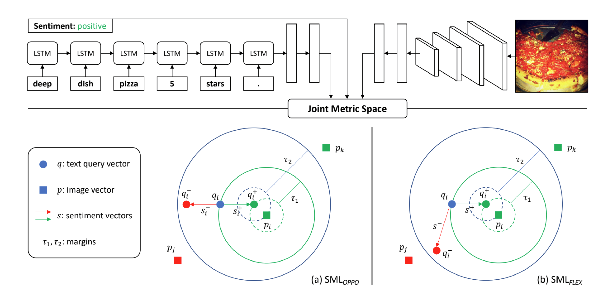

# SML: Sentiment-Oriented Metric Learning

This is the code for the paper:

**[Sentiment-Oriented Metric Learning for Text-to-Image Retrieval](https://drive.google.com/file/d/1rk94NlrfcqnIIiRsTuAi2zswHaSmbI4S)**
<br>
[Quoc-Tuan Truong](http://www.qttruong.com/) and [Hady W. Lauw](http://www.hadylauw.com/)
<br>
Presented at [ECIR 2021](https://www.ecir2021.eu)



We provide:

- Code to train and evaluate the models
- [Data](https://drive.google.com/drive/folders/1RtKG-2PrhXfKvzJ19NU7i8L2frke1U95?usp=sharing) to run experiments with SML

If you find the code and data useful in your research, please cite:

```
@inproceedings{truong2021sentiment,
 title={Sentiment-Oriented Metric Learning for Text-to-Image Retrieval},
 author={Truong, Quoc-Tuan and Lauw, Hady W},
 booktitle={European Conference on Information Retrieval, {ECIR} 2021}
 year={2021},
}
```

## How to run

Install required dependencies:

```bash
pip install -r requirements.txt
```

Train and evaluate the models:

```bash
python main.py --model [OPPO,FLEX] --dataset [VSO,Yelp] --testset [TESTSET] 
```

- Example for `VSO` dataset:
  ```bash
  python main.py --model OPPO --dataset VSO --testset FOLD1
  ```

- Example for `Yelp` dataset:
  ```bash
  python main.py --model FLEX --dataset Yelp --testset LA
  ```
 
Training arguments:
```bash
python main.py --help
```
```
optional arguments:
  -h, --help            show this help message and exit
  --config              CONFIG       
                        Path to the data config file
  --model {OPPO,FLEX}   Model name
  --dataset {VSO,Yelp}  Dataset name
  --testset             TESTSET     
                        Subset of the dataset used for evaluation
  --num_eval_samples    NUM_EVAL_SAMPLES
                        Number of samples for evaluation (default: 1000)
  --num_epochs          NUM_EPOCHS
                        Number of training epochs (default: 5)
  --batch_size          BATCH_SIZE
                        Training batch size (default: 256)
  --learning_rate       LEARNING_RATE
                        Learning rate (default: 1e-3)
  --shuffle_buffer      SHUFFLE_BUFFER
                        Shuffle buffer the training dataset (default: 1e5)
  --tau                 TAU             
                        Margin hyper-parameter of the model (default: 1.0)
  --latent_dim          LATENT_DIM
                        Number of dimensions of the metric space (default:
                        300)
  --act_fn              ACT_FN       
                        Non-linear activation function (default: 'tanh')
  --lambda_reg          LAMBDA_REG
                        Lambda value for the l2 regularization (default: 1e-4)
  --seed                SEED           
                        Random seed (default: 2020)
  --verbose             Verbose flag (default: True)
```


## Contact
Questions and discussion are welcome: www.qttruong.com